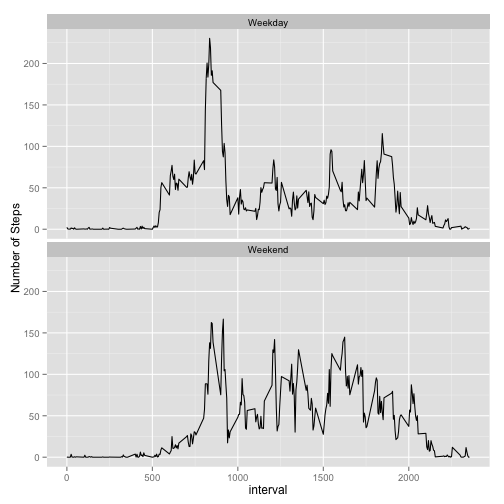

Reproducible Research Project 1
========================================================
## Loading and preprocessing the data
The following code will install and load libraries used in the code for this document, though the install is currently commented out.  If you would like to install the packages (it is relatively time consuming), please uncomment out the code.

```r
#install.packages("reshape2", repos='http://cran.us.r-project.org')
#install.packages("ggplot2", repos='http://cran.us.r-project.org')
library("reshape2", lib.loc="/Library/Frameworks/R.framework/Versions/3.1/Resources/library")
library("ggplot2", lib.loc="/Library/Frameworks/R.framework/Versions/3.1/Resources/library")
```
This data exists in Github and needs to have been downloaded along with this markdown document to the same directory.

```r
activity <- read.csv(unz("activity.zip", "activity.csv"))
```
## Mean total number of steps taken per day
The data from this csv will be transformed, a mean and median calculated and a histogram displayed.

```r
meltedActivity <- melt(activity, id=c("date"), na.rm=TRUE, measure.vars="steps")
castedActivity <- dcast(meltedActivity, date ~ variable, sum)
hist(castedActivity$steps)
```

 

```r
actMean <- format(round(mean(castedActivity$steps), 2), nsmall = 2)
actMedian <- median(castedActivity$steps)
```
The mean is 10766.19 and the median is 10765.

## Average daily activity pattern.
The data is reshaped to produce a plot based on interval time.

```r
meltedInterval <- melt(activity, id=c("interval"), na.rm=TRUE, measure.vars="steps")
castedInterval <- dcast(meltedInterval, interval ~ variable, mean)
plot( castedInterval$interval, castedInterval$steps, type="l")
```

 

```r
maxRow <- castedInterval[castedInterval$steps==max(castedInterval$steps),]
```
The maximum number of steps is 206.1698 at time interval 835.
## Imputing missing values

```r
x <- activity$steps
x1 <- length(which(is.na(x)))
```
There are 2304 missing values.  
We will now impute the missing values.  The method to impute the value is by assigning the average number of steps for each interval into those intervals with NA's.  With the imputed missing values we will create a histogram and calculate a mean and median as before.

```r
activityNa <- is.na(activity$steps)
castedIntervalAdj <- cbind(castedInterval, as.integer(round(castedInterval$steps)))
nonNaActivity <- activity[!activityNa,]
NaActivity <- activity[activityNa,]
NaResolved <- merge(NaActivity, castedIntervalAdj, by.x = "interval", by.y = "interval", all=FALSE )
NaResolved$steps.x <- NULL
NaResolved$steps.y <- NULL
names(NaResolved)[3] <- paste("steps")
NaResolvedActivity <- rbind(NaResolved, nonNaActivity)
meltedActivity <- melt(NaResolvedActivity, id=c("date"), na.rm=TRUE, measure.vars="steps")
castedActivity <- dcast(meltedActivity, date ~ variable, sum)
hist(castedActivity$steps)
```

 

```r
impMean <- format(round(mean(castedActivity$steps), 2), nsmall = 2)
impMedian <- median(castedActivity$steps)
```
The mean is 10765.64 and the median is 10762.  In this case the mean and median both were lower which seemed counter intuitive.   But when you looked at the missing values, they were missing for entire days not for selected intervals within a day.  What happened is that the methodology used to calcualte the missing values was based on interval time.  Due to rounding the sum for a day for these intervals were a little lower than the mean for the days.  This could have gone the other way.  Also if it was some intervals that were missing for days that had other values, the mean and median could have increased.
## Activity patterns between weekdays and weekends.

This is a time series of the data that is imputed for weekends and weekdays.   As you can see, the weekend distribution of steps is more spread out over the time periods than the weekday spread.

```r
wd <- !(weekdays(as.Date(NaResolvedActivity$date)) %in% c('Saturday','Sunday'))
wdwe <- c("", "")
for (i in 1:length(wd)) {
  if (wd[i]) {wdwe[i] <- "Weekday"} else {wdwe[i] <- "Weekend"}
}
NaResolvedActivity[, "dayType"] <- factor(wdwe)
p <- ggplot(NaResolvedActivity, aes(x=interval, y=steps)) + geom_line()
melted <- melt(NaResolvedActivity, id=c("interval", "dayType"), na.rm=TRUE, measure.vars="steps")
casted <- dcast(melted, interval + dayType ~ variable, mean)
p <- ggplot(casted, aes(x=interval, y=steps)) + geom_line() + ylab("Number of Steps")
p + facet_wrap(~ dayType, ncol=1)
```

 


